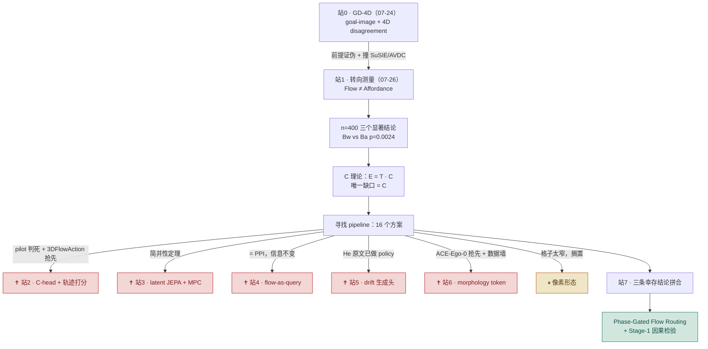
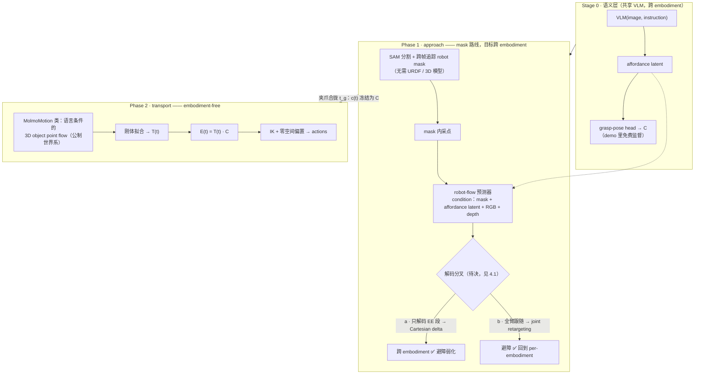
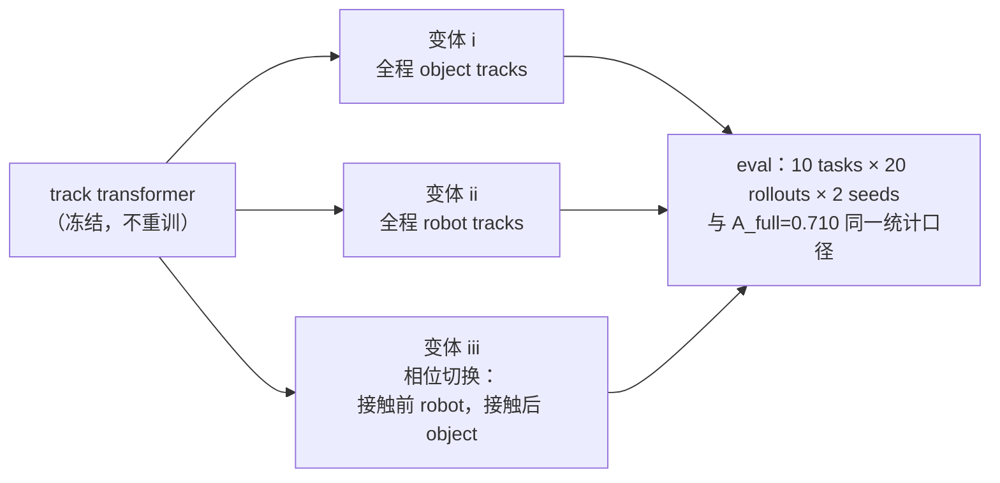

# Phase-Gated Flow Routing（相位路由）—— 设计文档

**日期** 2026-07-28 · **作者** yd3007@nyu.edu
**状态** 设计定稿，Stage-1 因果检验待启动（预算测量中）
**姊妹文档** `FLOW_AFFORDANCE_LOG.md`（测量数据）· `FLOW_TO_ACTION_SURVEY.md`（21 篇文献表）· `C_HEAD_PRIOR_ART.md`（查重记录）

---

## 0 · 一句话

> **flow 的语义应该按接触相位路由：接触前喂机器人通道，接触后喂物体通道，
> 切换点由 $C$（接触事件）定义。**

这不是拼凑出来的 A+B。我们的测量已经证明：flow 在 approach 段的价值全部来自机器人像素，
在 transport 段的价值全部来自物体运动 —— **这个设计只是把测到的事实显式地接成线路。**

查重现状（截至 2026-07-28）：pipeline 的每个组件单独看都已有已发表的工作，
但**「按相位切换 flow 语义」这个整体接线没有先例** ——
最接近的 ChronoFlow-Policy 是把两种 flow 全程同时喂给 policy，不切换、不分相位。

---

## 1 · 理论根基

### 1.1 场景与记号

考虑一次典型的抓取-搬运任务：机械臂把桌上的杯子拿起来，放到另一个位置。
整个过程按「夹爪是否已经抓住物体」分成两段：

- **approach（接近段）**：从任务开始，到夹爪合拢抓住物体为止。这一段**物体没动，只有机械臂在动**
- **transport（搬运段）**：抓住之后，物体随夹爪一起移动，直到放下

涉及三个量，都是刚体位姿（位置 + 朝向，数学上是 $SE(3)$ 元素）：

| 符号 | 含义 | 用杯子举例 |
|---|---|---|
| $T(t)$ | 物体在 $t$ 时刻的位姿 | 杯子现在在哪、朝向如何 |
| $E(t)$ | 夹爪在 $t$ 时刻的位姿 | 机械臂末端在哪、朝向如何 |
| $C$ | 抓住期间，夹爪**相对物体**的位姿 | 「虎口卡在杯把上、掌心朝左」—— 即**抓法** |

### 1.2 核心事实：抓住之后，$C$ 是常数

抓稳之后，夹爪和物体之间没有相对滑动，两者像一个刚体一样一起运动。
所以夹爪相对物体的位姿 $C$ 在整个 transport 段**保持不变**，且三者满足：

$$E(t) = T(t)\cdot C \qquad(\text{transport 段恒成立})$$

用杯子读这个式子：知道杯子接下来要怎么走（$T$），又知道手是怎么握着杯子的（$C$），
夹爪该走的轨迹（$E$）就唯一确定了 —— 一次矩阵乘法。
（数据支持：在 LIBERO 仿真的演示数据上实测，抓住之后 $C$ 的变化只有 2–3 mm，
「常数」这个近似是成立的。）

$C$ 在任务的不同时段扮演不同角色：

| 时段 | $C$ 的状态 |
|---|---|
| approach 段 | $C$ **还不存在** —— 夹爪相对物体的位姿一直在变。这一段的实质是：先**选定**一个抓法 $C^*$，再把夹爪移动到能实现它的位置 |
| 合拢瞬间（记 $t_g$） | 抓法定型，$C$ 从此有了固定值 |
| transport 段 | $C$ 恒定，$E=T\cdot C$ 生效 |
| 放下松手后 | 夹爪与物体分离，$C$ 不再有意义 |

### 1.3 四条定理

**定理 ① 不变性：物体的 flow 里不含「该抓哪」的信息。**
把杯子从 A 搬到 B：无论抓杯把还是抓杯壁，**杯子本身走的路完全一样**，
所以杯子上任何点的运动轨迹（= 物体的 flow）也完全一样。
一个不随抓法变化的信号，不可能告诉你该用哪种抓法。
（信息论的说法：object flow 与 $C$ 的互信息为零。）

**定理 ② 分解：从 flow 到 action，缺的信息恰好等于 $C$。**
从 flow 恢复 $T$ 是成熟技术（刚体拟合）；有了 $T$ 和 $C$，transport 段的动作就是
$E=T\cdot C$，一次矩阵乘法；approach 段的目标位置是 $E(t_g)=T(t_g)\cdot C$ ——
不知道 $C$ 就没有目标，知道了 $C$，剩下的是标准的运动规划。
**所以整条链路里，flow 给不了、又必须有的信息，不多不少恰好是 $C$。**

**定理 ③ 冗余：预测机器人自己的 flow 不提供新信息。**
由定理②，$T$ 和 $C$ 一旦给定，夹爪的运动就完全确定了。
因此如果一个方法因为「预测了机器人的 flow」而性能变好，
新信息不可能来自 flow 本身 —— 只能是 $C$ 或其他 embodiment 信息从别的渠道**漏了进来**。

**定理 ④ 权衡：抓法信息量和跨机器人可迁移性，两头只能占一头。**
只追踪物体上的点：flow 与机器人无关，换机器人照样能用（甚至能从人类视频学），
但由定理①它不含抓法信息。把机器人身上的点也加进来追踪：flow 里就有抓法信息了
（机器人的运动就是动作本身），但 Franka 手臂的 flow 换一台机器人就没用了。

### 1.4 $C$ 的信息从哪来

给定一张图和一条任务指令，合理的抓法通常**是一个集合而不是一个点**：
杯子可以抓杯把、也可以抓杯身。任务会缩小这个集合（要倒水，就不该抓水会经过的杯沿），
夹爪类型也会（吸盘和平行爪的可行抓法不同）。形式化地，$C$ 服从条件分布
$p(C \mid \text{图像}, \text{指令}, \text{夹爪})$。

这些条件里，**图像 + 语言承载了绝大部分信息** —— 恰是视觉语言模型擅长的领域；
flow 在此之外的额外贡献，实测上界只有 4.8 个百分点（见 §2）。
还有一部分信息 —— 物体的重量分布、表面摩擦、毫米级的装配间隙 ——
**连视觉都不携带**，只能从执行的成败反馈中获得。

---

## 2 · 实测证据

### 2.1 先看三个数，整个测量的结论就在这里

实验方法：拿训练好的 ATM policy，在评测时**破坏它的 flow 输入的某一部分**，看成功率掉多少。
掉得多 = 那部分 flow 真的在起作用。基线（不破坏）成功率 **0.710**。

| 破坏什么 | 成功率变化 | 说明什么 |
|---|---|---|
| **approach 段 · 腕部相机的 flow**（画面 21% 是机器人） | **−9.5 个百分点**（p=0.006，真实效应） | approach 段 flow 有用 —— 但用的是**机器人自己的像素** |
| **approach 段 · 第三人称相机的 flow**（画面 9% 是机器人） | **0**（能排除超过 4.8 个百分点的任何效应） | 同一阶段、同样静止的物体，**物体通道毫无贡献** |
| **transport 段 · 全部 flow** | **−29 个百分点**（p=0.0012） | flow 真正的功劳在这里 —— 物体动起来之后 |

**一句话结论：flow 在 approach 段的价值全在机器人像素（= 泄漏），
在 transport 段的价值全在物体运动（= 正当收益）。两条信道，两个相位，泾渭分明。**

### 2.2 完整统计表（供核对，可跳过）

10 tasks × 20 rollouts × 2 seeds = 400 episodes/条件；按 task 配对 t 检验（df=9）；
p < 0.05 视为显著；CI 不跨零 = 显著。

```
条件                        破坏方式                  mean      Δ        p       结论
A_full                     不破坏（基线）            0.710      —        —       —
Bw_approach_wrist          approach·只掐腕部        0.615   -0.095   0.0060    显著 ✅
Ba_approach_agent          approach·只掐第三人称     0.712   +0.003   0.9043    等价检验：效应≤4.8点
B_approach                 approach·两个都掐        0.637   -0.072   0.0829    不显著（见下）
C_transport                transport·两个都掐       0.420   -0.290   0.0012    显著 ✅
F_all                      全程两个都掐              0.337   -0.372   <0.0001   破坏上限参照
Bw vs Ba                   上面两行直接对比            —     -0.098   0.0024    主结果 ✅
```

注 `B_approach` 为什么反而不显著：掐第三人称不带来效应、只带来方差（task 间标准误 +40%），
把一个真效应和一个零混在一起稀释了信噪比 —— **这本身就是「信道要分开路由、不要混喂」的证据**，
也是本设计的动机之一。

### 2.3 外部佐证（他人发表的数字，可直接引用）

| 来源 | 数字 | 与本设计的关系 |
|---|---|---|
| ChronoFlow-Policy 的 ablation | 去掉 gripper flow：87%→80% | 机器人通道价值 ~7 点 —— 与我们的 −9.5 同量级，但它是单任务、无阶段切分 |
| ACE-Ego-0 的 ablation | 去掉 URDF morphology token：−1.9 点 | 形态信息在分布内的价值很小 |
| Cloak 的 zero-shot | 擦掉机器人视觉 + 指尖空间动作 = 81.8–86.3% | 机器人像素携带的信息可被 state 替代 |
| ATM 源码 | `sample_from_mask(np.ones((H,W,1))*255, ...)` | 全图均匀采样、不分物体/机器人 —— 泄漏的源头，白纸黑字 |

---

## 3 · 进化史：从 GD-4D 到相位路由，每一步为什么非走不可

这一节是整个项目思考过程的浓缩。两天里前后提出 **16 个方案：14 个被否决，
1 个因价值天花板太低而搁置，1 个存活 —— 就是本文档。**
重要的不是死了多少，而是**每一个死因都变成了最终设计的一条决定**（见 3.9 的对应表）。

### 3.1 站 0 · GD-4D（07-24，存活一天）

**当时想做**：goal-image 条件的 policy，用一个冻结的 4D backbone 的几何一致性当
disagreement 信号，来检验「模型梦出来的目标图」是不是错的。

**为什么停**：三个独立原因同时成立 ——
① 自己的实验证伪了前提：confound-free 的 delta = 0.51（等于随机猜），
几何一致性**检测不出**错误目标；
② pipeline 本身 ≈ SuSIE + AVDC，已是别人的工作；
③ 剩下的空隙（「加一个 verifier」）是审稿人明确会拒的增量式方案。

**带走了什么**：教训「**先查 prior art，再写代码**」（GD-4D 的 23 个 commit 全在查重之前）；
以及一条后来复活的结论 —— 几何信号判不出错误目标，**只有从结果学出来的 critic 可以**。

### 3.2 站 1 · 转向测量：Flow ≠ Affordance（07-26）

**当时想做**：既然 architecture 类 idea 当天存活率 0/8、measurement 类 2/2，
就做测量 —— 学界把 flow 当 affordance 卖，但 object flow 对抓法**不变**（定理①），
它不可能含有「该抓哪」的信息；那这些方法的性能从哪来？猜想：从被顺手追踪的机器人像素来。
**没有人量过这件事。**

**为什么能做**：ATM/PPI 代码和 checkpoint 全开源；LIBERO 本机可复现；
阶段切分的判据（夹爪开合）现成。

**产出**：§2 的全部数字（n=400，三个显著结论），以及结晶出来的 $C$ 理论 ——
$E=T\cdot C$，整条 pipeline 里唯一没有干净来源的量就是 $C$。

### 3.3 站 2 · 第一个 pipeline 尝试：C-head + 轨迹打分（07-26 夜 – 07-28）

**当时想做**：只预测物体 flow（保住跨 embodiment 的卖点），$C$ 用一个小模块预测，
再用已知的物体轨迹 $T(t)$ 给候选抓法**打分筛选**（比如「要放进窄抽屉，就提前排除从上方抓」）。

**为什么不行**：死了两次 ——
① **自己的 pilot 杀的**：预先定死判据（headroom < 5 点 → 放弃）之后实测：
自由空间里 headroom 只有 0–3 点（挑不挑无所谓）；紧公差场景里可行性**根本不是 $(C,T)$ 的函数**
（取决于毫米级间隙和 7-DoF 冗余解算，这些信息输入里没有）；
② **查重杀的**：3DFlowAction（2025-06）已把「object flow → $T$ → 用 $T$ 过滤抓取 →
$E=T\cdot C$ → 跨 embodiment」整条搭出来。

**带走了什么**：**$C$ 只预测、不打分** —— 后续所有设计再没让 $T$ 参与选 $C$。

### 3.4 站 3 · latent JEPA world model + MPC

**当时想做**：flow 毕竟只是给人看的，把它压进 latent；world model 预测「action 会让
latent 怎么变」，与目标 latent 求偏差反解 action，或直接 MPC。

**为什么不行**：纯理论否决，不用查文献 —— **简并性**。抓杯把和抓杯壁在 pixel flow 里
不可区分，在任何 latent 里同样不可区分（latent 是 flow 的函数）；
**一次坐标变换不能把非单射的映射变成单射**。MPC 的 cost 定义在物体 latent 上，
零空间里所有 action 代价相同，MPC 会随便挑一个 —— 那是「随机采一个抓取」的连续版。

**带走了什么**：**留在显式空间** —— $E=T\cdot C$ 有解析解的地方，不要用学习去逼近。

### 3.5 站 4 · flow 当 query 的 attention

**当时想做**：物体 flow 作为 query，去 action 空间里「查」出与之一致的动作。

**为什么不行**：① 机制上这就是 PPI（action token attends to pointflow token，
方向反过来是因为 attention 的输出挂在 query 侧）；② 信息上什么也没变 ——
「与给定 flow 一致的动作集合」有闭式解，整个解集被 $C$ 参数化，
attention 能做的只是从 demo 先验里挑一个 $C$。

**带走了什么**：两样最重要的东西 ——
**一票否决问题**：「这个方案里，$C$ 的信息从哪一个输入进来？」
（答不出 / 答 demo 先验 / 答机器人像素 → 10 秒否决；16 个方案里 15 个死在这上面）；
以及一句可直接进论文的 formulation：**flow 是约束项，约束集由 $C$ 参数化**。

### 3.6 站 5 · drift 生成头

**当时想做**：用 Kaiming He 的 drifting（生成负样本对比、一步生成）做 flow-conditioned
的 action 生成。

**为什么不行**：① He 的原论文实验里**就有** policy（1-NFE 打平 100-NFE 的 Diffusion Policy）；
专做 drift policy 的论文已有三篇；② 概念混淆：drift 的负样本是**模型自己生成的**、
用于分布匹配的机制，不携带任务成败信息 —— 换生成头不改变信息内容。

**带走了什么**：「action 有很多错的、应该利用起来」这条直觉指向的真正方向是
**execution-outcome critic**（从执行成败学 $C$）—— 它是目前唯一通过一票否决问题的
方法方向，作为独立的大项目备案。

### 3.7 站 6 · morphology token（以及像素形态的半站）

**当时想做**：PPI 的 attention 里加入机器人形态信息，修跨 embodiment 的短板。

**为什么不行**：① ACE-Ego-0 等已做（URDF graph 过 GNN 出 token、条件 action expert），
且 ablation 实测只值 **+1.9 点**；② 更根本的墙：**训练数据不跨形态，形态 token 就是空转**
（token 是常数时网络直接忽略它）。

**半个转机**：随后发现那批工作全部依赖 URDF/mesh/点云 —— 「从 RGB 像素提取形态」这格
确实没人做。但精读 ACE-Ego-0 和 Cloak 之后边界收窄：Cloak 证明双指域内
「擦掉机器人 + 指尖空间动作」zero-shot 已达 85%，**根本不需要 policy 理解形态**；
剩余格子（像素形态 × 富接触 × 无标定数据）太窄 → **搁置，不否决**。

**带走了什么**：embodiment-specific 的东西要么擦除（Cloak 路线）、要么**显式圈进一个
per-embodiment 模块**里 —— 不能散落在输入里。

### 3.8 站 7 · 综合与收敛（07-28）

到这里，散落的结论开始自己拼合：

- **$C$ 和 $T$ 是两条独立信道**（PPI Table VII 的零交互项：keypose 单独 +6.0、
  叠在 pointflow 上 +6.5 —— 独立性的直接证据）
- **VLA 把 $C$ 稀释掉了**：每步均匀输出 action chunk，contact moment 没有任何特殊处理，
  最关键的一个决策被摊进几百个 timestep —— keyframe 文献的存在就是学界对此的集体反应
- **信道混喂有害**：`B_approach` 的不显著（§2.2 注）说明把零效应通道混进来只稀释信噪比

于是自然的下一问是：**既然两条信道分居两个相位，为什么不显式地按相位路由？**
接触前，唯一有信息的 flow 是机器人自己的（夹爪的未来轨迹≈动作本身）；
接触后，$c(t)$ 冻结成 $C$，物体 flow + 一次矩阵乘法 + IK 就够了。
查重确认：**这个接线没有先例**。而且它不需要先搭完整系统 ——
track transformer 不用动，只重训三个 BC 变体就能对「相位路由是否有净值」做因果检验（§5）。

### 3.9 尸检报告 → 设计决定的对应表

| 哪一站死的 | 死因 | 变成了最终设计的哪条决定 |
|---|---|---|
| 站 2 · 轨迹打分 | headroom≈0；紧公差不可计算 | $C$ 只预测、不打分 |
| 站 3 · latent JEPA | 简并性 | 留在显式空间，transport 用解析链 $E=T\cdot C$ + IK |
| 站 4 · flow-as-query | = PPI；信息不变 | 解释 PPI 而非重造它：显式路由替代黑箱融合 |
| 站 6 · morphology 墙 | 占位 + 数据墙 | embodiment-specificity 显式圈进 Phase 1 |
| 测量 · `B_approach` 不显著 | 混喂稀释信噪比 | **路由，不混喂** —— 本设计的名字由此而来 |



---

## 4 · Pipeline 设计（2026-07-28 深夜修订版）

> **修订记录**：① approach 段从「per-embodiment（认了）」修订为「mask 路线下可跨
> embodiment，但有一个待决的解码分叉」；② Stage-2 的物体 flow 预测器指定为
> MolmoMotion 类 VLM（省掉自训）；③ 语义层统一到一个共享 VLM + affordance latent。



### 4.1 approach 段可迁移性的修订论证（含一个待决分叉）

**机制上不需要 URDF**：SAM 分割 + 跨帧追踪 robot mask + mask 内采点即可取到机器人点
（EC-Flow 的采点方式；Shadow 证明 mask 是可行的 embodiment 表示）。
多机器人数据集（OXE 类）上训练后，flow **预测器**对新机器人外观的泛化是可信假设 ——
且 mask 路线不需要相机标定，修好了「无标定数据拿不到机器人像素」的旧问题。

**真正的分叉在解码端** —— 预测出的 robot flow 怎么变成这台机器人的 action：

| 选项 | 跨 embodiment | 避障 | 依据 |
|---|---|---|---|
| **(a) 只解码 EE 段 flow** → depth 反投影 → Cartesian delta | ✅ 近乎通用 | ⚠️ 弱化为「EE 路径避障」 | Cloak 的 85% zero-shot 就是这条路的实证 |
| **(b) 全臂跟随**（含手肘） | ❌ joint-level retargeting，回到 per-embodiment | ✅ 完整 | — |

要害：**避障价值恰好住在 arm-body flow 里，而那正是对未见过的臂预测最不可靠、
错了后果最重（碰撞）的部分。** 当前决定：**v1 走 (a)**，(b) 留作升级路径。

**其余取舍不变**：「action 被完全 constrain」只对手成立（零空间、transport 段障碍、
力控出圈、紧公差不可计算）；depth 作为输入会限制可用的预训练数据
（OXE 一大半子集无 depth → 单目深度估计或接受数据缩水）。

### 4.2 与已有工作的差异

| 已有工作 | 它的做法 | 本设计的不同处 |
|---|---|---|
| PPI | keypose + pointflow 同时喂，attention 黑箱融合 | 显式相位路由 + 解析组合；且能**解释**为什么需要两个 interface |
| 3DFlowAction | AnyGrasp 给 $C$、planner 走 approach、flow 只管 transport | approach 段是学习的场景感知模块；$C$ 头可学可微 |
| **MolmoMotion** | **只做 post-grasp**（"focus on the post-grasp stage"），grasp 从 MolmoBot 搬（$C$ 外部来源第 22 例），flow→action 是**学出来的** flow-matching head | 我们把它当 Stage-2 的现成 $T$ 预测器；执行走**解析链**（站 3 教训：有解析解不学习），并补上它明说不做的 approach 半边 |
| EC-Flow | 全程只用机器人 flow | 只在 approach 段用机器人 flow，transport 切到物体 flow |
| ChronoFlow-Policy | 两种 flow 全程同时喂 | **切换 vs 混喂 —— 正是 Stage-1 要检验的差异** |
| Cloak | 擦掉机器人视觉 + 指尖空间迁移 | 互补：它的 85% 是解码选项 (a) 的可行性证据 |

---

## 5 · 实现路线

### Stage 1 —— 低成本因果检验（先做；这是可发表的最小单元）

**核心：track transformer 不动（它本来就预测全图 track），只重训 BC policy（101 epochs）。**



**实施步骤：**

1. **track 打标**（一次性离线）：回放 LIBERO demo 渲染 robot segmentation
   （robosuite 离屏渲染 `segmentation=True`）；每条 track 按 **t=0 像素**是否落在
   robot mask 内打标签（tracked point 物理上不换主，t=0 分类即可）
2. **相位边界**：夹爪合拢锁存（`action[:, -1] > 0`），与探针同一判据。
   ⚠️ freeze 事故的教训要检查：路由不改变 track 内容本身（都是真实预测），
   不制造 OOD 输入、不锁死状态机 —— 但变体 iii 仍需先跑 sanity check
3. **dataloader 改造**：`atm/dataloader/bc_dataloader.py:71` 的
   `sample_tracks_nearest_to_grids(..., num_samples=32)` 加标签+相位过滤；
   给 policy 一个相位指示位
4. **重训 3 × BC（101 epochs each）**，eval 复用现有全套（同 seeds、同统计口径）

**预注册预测（看数据之前写死）：**

- P1：变体 iii ≥ 变体 i（显式补上机器人通道，拿回 approach 段的 ~9.5 点）
- P2：变体 iii ≥ 变体 ii（transport 段物体通道价值 ~29 点）
- P3：变体 iii ≈ A_full（0.710）—— 显式路由不输隐式泄漏
- **终止判据**：iii 对 max(i, ii) 的增益 < 3 点（配对 t 不显著）→ 相位路由无净值，
  本设计降级为 measurement 论文的 negative appendix

**预算**：BC 单 epoch 墙钟 × 101 × 3 + eval 6 次 × ~25 min。单 epoch 时间**待测**（下一步）。

### Stage 2 —— 完整 pipeline（仅当 Stage 1 通过）

C-head（$p(C\mid\cdot)$，demo 免费监督）+ approach policy（DINO+depth+robot flow）+
transport 解析链（SVD → $E=T\cdot C$ → 零空间偏置 IK）。跨 embodiment 验证在
robosuite 换爪（Panda→Robotiq85）。**Stage 1 数字出来之前不投入。**

### 论文形态

**diagnosis + fix**：§3 = 测量（已完成，n=400 全套），§4 = 相位路由（Stage 1 因果检验
+ 可选 Stage 2），§5 = 21 篇 survey 支撑的定位。主结果：`Bw` vs `Ba` p=0.0024（诊断）
+ 变体 iii vs i/ii（修复）。

---

## 6 · 风险清单（不打折）

1. **planner baseline**：approach 避障的经典解是 motion planning（构造保证）；
   学习模块必须在杂乱场景 benchmark 上正面胜过 RRT 类才立得住
2. **预期增益是个位数百分点**：ChronoFlow 的 7 点、我们的 9.5 点就是天花板量级；
   没有新的信息源（一票否决问题的答案：$C$ 仍来自 vision+language+demo）
3. **LIBERO-spatial 可能太简单**：物体稀疏、杂乱度低，场景感知的价值展示不出来 ——
   Stage 1 若通过，Stage 2 应换更杂乱的 suite（libero_90 / RoboCasa）
4. **变体 iii 的相位切换给 policy 输入引入非平稳性** —— sanity check 先行
5. **解码分叉未决**（§4.1）：v1 选 (a) 意味着避障 claim 弱化；选 (b) 则跨 embodiment
   claim 弱化 —— 二者只能占一头，论文里必须明说
6. **depth 依赖**：OXE 一大半子集无 depth，approach 预测器的预训练数据受限
7. **时效**：「没有先例」的判定截至 2026-07-28；动手前重查一轮 arXiv

---

## 7 · 文件与资产索引

| 资产 | 位置 |
|---|---|
| 本文档 | `/workspace/research/d4rt/PHASE_GATED_FLOW_ROUTING.md` |
| 在线版（artifact） | https://claude.ai/code/artifact/ff22272f-acc7-4ddc-a7ae-8c8333c53910 |
| 测量数据 + 事故复盘 | `FLOW_AFFORDANCE_LOG.md` |
| 21 篇文献三表 | `FLOW_TO_ACTION_SURVEY.md` |
| 查重记录（含 ACE-Ego-0 / Cloak 精读） | `C_HEAD_PRIOR_ART.md` |
| flow 探针（shuffle/anchored/分相位/分视角） | `/workspace/code/ATM/atm/utils/flow_probe.py` |
| BC dataloader 改造点 | `/workspace/code/ATM/atm/dataloader/bc_dataloader.py:71` |
| 泄漏源头证据 | `/workspace/code/ATM/scripts/preprocess_libero.py:127` |
| conda env | `atm5090`（py3.10 + torch 2.11+cu128） |
